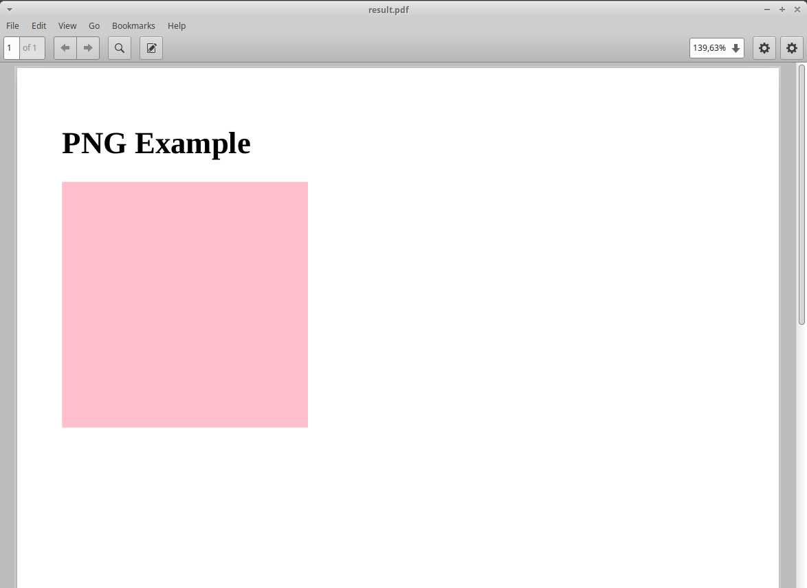

# Building Templates

## Template design considerations

Typical report template design will require external resources, such as Javascript libraries and web fonts. These
resources
can be added locally or referenced externally from eg. CDNs, as any regular web page. However, keep in mind that
referencing
external resources may pose a security risk, and requires internet access when generating PDFs.

Having these resources locally will reduce the PDF rendering time and minimize or eliminate the need to have internet
access,
but will increase the packaged report size and the effort required to maintain reports. Some assets may also have
licensing
limitations that prevent usage and redistribution in a packaged format.

The recommended approach depends on the use case. Reports where PDF rendering time is not critical can reference
resources
externally as needed; Reports where rendering time is critical (such as generated in response to a user interaction)
should
have these resources referenced locally, as much as possible.

## ZipReport Jinja considerations

ZipReport allows most Jinja features, including adding your own filters. However, you can only import templates within
your report folder path (including subfolders). Adding extensions to Jinja is also supported, when using the JinjaRender
class directly. It works by instantiating *zipreport.template.JinjaRender* with
the required options:

```python
from zipreport.report import ReportFileLoader
from zipreport.template import JinjaRender

# load report from file
zpt = ReportFileLoader.load("simple.zpt")

# extensions for jinja usage
jinja_options = {
    "extensions": ['jinja2.ext.i18n'],
}

# initialize JinjaRender() with the desired options
renderer = JinjaRender(zpt, jinja_options)
```

## CSS considerations

When using zipreport-server, be aware that the media type *print* will be used for PDF generation.

## Waiting for JavaScript execution before rendering

Some reports may contain complex JavaScript logic for page composition, and timing the finalization of these operations
are a challenge. ZipReport provides a more reliable alternative to relying on waiting a predefined amount of time before
triggering the render -
a JavaScript event notification system that explicitly notifies the supervisor application that client-side rendering is
finalized and PDF generation can be done.

The notification mechanism works by writing the string '**zpt-view-ready**' to the console. As an example, this can be
used to signal
paged.js end of operations:

```html
<!DOCTYPE html PUBLIC>
<html lang="en" lang="en">
<head>
    <script src="https://s3.amazonaws.com/pagedmedia/pagedjs/dist/paged.js"></script>
    <script>
        // custom paged.js handler
        class handlers extends Paged.Handler {
            constructor(chunker, polisher, caller) {
                super(chunker, polisher, caller);
            }

            afterPreview(pages) {
                // event signaling readiness for PDF generation
                console.log('zpt-view-ready')
            }
        }

        // Register handler on paged.js library
        Paged.registerHandlers(handlers);
    </script>
</head>
<body>
```

## Generating images dynamically

ZipReport provides several filters that allow the generation and inclusion of images generated in runtime, without
requiring
client-side composition. This is quite useful to add data-driven graphics to the reports, both for PDF and MIME
generation.

The image is generated by calling a function that will save the results to a io.BytesIO memory buffer. This buffer will
be added to the in-memory representation of the report file as an image with a random name by the filter, and then the
appropriate html image tag will be generated, for rendering purposes.

### Bundled Jinja filters for images

| Filter name | Description                  |
|-------------|------------------------------|
| png         | Generates dynamic PNG image  |
| gif         | Generates dynamic GIF image  |
| jpg         | Generates dynamic JPEG image |
| svg         | Generates dynamic SVG image  |

Call syntax:

```
Positional args:
    {{ callable | filter(data_source, alt_text, width, height, css_class }}

Named args:
    {{ callable | filter(data=data_source, alt=alt_text, width=width, height=height, class=css_class }}
```

Where:

| Name        | Description                                                                               |
|-------------|-------------------------------------------------------------------------------------------|
| callable    | function that will generate the specific graphic; it is passed as a template variable     |
| filter      | bundled jinja filter to generate the appropriate img tag; see below for available filters |
| data_source | variable with data to be passed to the callable as a parameter                            |
| alt_text    | optional img tag alt text                                                                 |
| width       | optional image tag width                                                                  |
| height      | optional image tag height                                                                 |
| css_class   | optional image tag css classes                                                            |

### Writing an image generation function for an image filter

Writing a function to be used dynamically in the report is quite simple; it is a regular function that receives
an argument and returns a io.BytesIO buffer object.

Below we'll see a complete example on how to generate and embed a simple image on a template. The complete code is
available on the examples/filter_simple folder.

Example file list:

```
sample_report/index.html
sample_report/manifest.json
main.py
```

We start with a simple html template and a manifest file into the sample_report folder:

Html template (index.html):

```html
<!DOCTYPE html>
<html lang="en">
<head>
    <meta charset="UTF-8">
    <title>Zipreport jinja filter example</title>
</head>
<body>
<h1>PNG Example</h1>
{{ colored_rectangle_fn|png(rectangle_color, "label for png") }}
</body>
</html>
```

Manifest file(manifest.json):

```json
{
  "author": "zipreport",
  "title": "Jinja Filter example",
  "description": "Dynamic jinja filter example",
  "version": "1.0",
  "params": [
    "colored_rectangle_fn",
    "rectangle_color"
  ]
}
```

We can now build the report:

```shell
$ zipreport build sample_report

== Building Report simple_report.zpt ==
Checking manifest & index file...
Building...
Copying manifest.json...
Copying index.html...
Generating simple_report.zpt...
Done!
```

Then, we start writing our main.py code. First, we create our image generation function. This function will generate
a png colored rectangle using PIL, based on the specified color passed as argument (in this case, the value will
come from the rectangle_color template variable), and returns a *io.BytesIO* buffer.

```python
import io
from PIL import Image


def render_image(color='red') -> io.BytesIO:
    # generate a rectangle with the specified color
    img = Image.new('RGB', (256, 256), color=color)
    # save generated image to a memory buffer
    buffer = io.BytesIO()
    img.save(buffer, format='PNG')
    # rewind to the beginning of the buffer
    buffer.seek(0)
    return buffer
```

Lastly, we add some boilerplate to load, process and save the report. This example relies on zipreport-server for
rendering
(Some additional validations were omitted for readability):

```python
if __name__ == "__main__":

    args = sys.argv[1:]
    pdf_name = Path(args[0])  # output file path

    report_name = "simple_report.zpt"
    report = ReportFileLoader.load(report_name)

    # template variables
    report_data = {
        # our callback function to generate the image
        'colored_rectangle_fn': render_image,
        # desired color to use
        'rectangle_color': 'pink',
    }

    # render using zipreport-cli processor
    result = ZipReport("https://127.0.0.1:6543", "somePassword").render_defaults(report, report_data)
    if not result.success:
        print("An error occured while generating the pdf:", result.error)
        exit(1)

    # save io.BytesIO buffer to file
    with open(pdf_name, 'wb') as f:
        f.write(result.report.read())
```

We can now run our example program:

```shell
$ python3 main.py result.pdf
Report generated to result.pdf
$
```

Expected result contents:



### Using placeholders for previewing purposes

Due to the dynamic nature of the dynamic image generation, it is not possible to preview the report correctly with
*zipreport debug*.
To work around this limitation, it is possible to specify a placeholder image (local or remote) instead of the callable
parameter.
The data source parameter, while mandatory, is ignored.

Following on the previous example, we can add a data.json to simple_report1 with a string url for an image instead of
the callable
function. This url can either be external (ex. a placeholder generation site) or local (a local image within the
template
structure):

data.json contents with a placeholder url:

```json
{
  "colored_rectangle_fn": "https://placehold.co/400",
  "rectangle_color": ""
}
```

data.json contents with a local image:

```json
{
  "colored_rectangle_fn": "/images/png_graphic.png",
  "rectangle_color": ""
}
```

## Extend Jinja2 by using a custom Environment wrapper class

Starting with version 2.2.0, zipreport supports programmatic customization of the Environment() used by Jinja2 for
template rendering, allowing injection or override of custom definitions such as filters, tests, etc. 

To create a custom Environment() wrapper, create a class inheriting from **zipreport.template.EnvironmentWrapper**,
and override the method wrap() to provide the required behaviour:
```python
import markupsafe
from jinja2 import Environment, pass_environment
from zipreport.template import EnvironmentWrapper

@pass_environment
def defoxifier(*args, **kwargs) -> markupsafe.Markup:
    """
    Example filter that replaces "fox" with "racoon"
    """
    al = len(args)
    if al < 2:
        raise RuntimeError("Invalid number of arguments")

    text = args[1].replace("fox", "racoon")
    return markupsafe.Markup(text)


class MyCustomWrapper(EnvironmentWrapper):
    def wrap(self, e: Environment) -> Environment:
        # perform Environment customization here
        # in this case, register a custom filter
        e.filters["defoxifier"] = defoxifier
        
        # return Environment
        return e
```

The class can then be used to create the wrapper object, and passed to an existing processor:
```python
# create custom wrapper object
my_wrapper = MyCustomWrapper()

# render using zipreport processor
processor = ZipReport("https://127.0.0.1:6543", "somePassword") 
result = processor.render_defaults(
    report, 
    report_data, 
    wrapper=my_wrapper # our custom Environment wrapper 
)
```

## Page numbers, headers and footers

Page numbers, headers and footers can be generated automatically using [paged.js](https://www.pagedjs.org/). Please
check paged.js documentation for detailed information on available formatting options and advanced usage.

To ensure correct PDF generation, specially on lengthy or complex documents, it is recommended to always enable the
[js signaling](#waiting-for-javascript-execution-before-rendering) functionality.

### Including paged.js on your report

The most convenient way of including paged.js is to use the CDN link in your html report page:

```html
<!DOCTYPE html>
<html>
<head>
    <!-- PagedJS -->
    <script src="https://unpkg.com/pagedjs/dist/paged.polyfill.js"></script>
    <style type="text/css">
        <!--
        custom CSS rules goes here

        ;
        see below

        -->
    </style>
</head>
<body>
<!-- page content goes here -->
</body>
</html>
```

### Adding page numbers

Extending on our previous example, we can now add page numbers to the bottom right corner of the page via css:

```css
@page {
    /* page footer */
    @bottom-right {
        /* page numbers will be prefixed by string "page" */
        content: "page " counter(page);
    }
}
```

### Configuring page breaks

Forcing page breaks on specific sections is also possible. In this example, we will add page breaks for <section> tags:

```css
/* section tag triggers page break */
section {
    break-before: page;
}
```

Now each section block will trigger a page break on our report:

```html
(...)
<body>
<section>
    <h1>this is page 1</h1>
</section>

<section>
    <h1>this is page 2</h1>
</section>
</body>
```

### Adding a header

To add a header with the current chapter name, we map the heading tag (in this case, H1) to a variable,
and then we extend our @page CSS definition to display that var on the top right corner of the page:

```css
(
...

)

@page {
    /* display 'title' contents in the top right corner of the page, in uppercase */
    @top-right {
        content: string(title);
        text-transform: uppercase;
    }
(...)
}
```

### Adding a footer

Adding a static footer is similar to the approach used for page numbering. Just choose the desired page location and
specify
the desired content:

```css
(
...

)
@page {
    /* display static text on the footer */
    @bottom-center {
        content: "sample footer"
    }
(...)
}
```

### Complete example

This is how our final version of a two-page report, with page numbers in the bottom right corner, a page header with the
current
chapter name in uppercase, and a fixed footer with a sample text looks like:

```html
<!DOCTYPE html>
<html>
<head>
    <!-- PagedJS -->
    <script src="https://unpkg.com/pagedjs/dist/paged.polyfill.js"></script>
    <style type="text/css">
        /* 'title' variable comes from h1 contents */
        h1 {
            string-set: title content(text);
        }

        /* section tag triggers page break */
        section {
            break-before: page;
        }

        @page {
            /* display 'title' contents in the top right corner of the page, in uppercase */
            @top-right {
                content: string(title);
                text-transform: uppercase;
            }

            /* display static text on the footer */
            @bottom-center {
                content: "sample footer"
            }

            /* page footer */
            @bottom-right {
                /* page numbers will be prefixed by string "page" */
                content: "page " counter(page);
            }
        }
    </style>
</head>
<body>
<section>
    <h1>this is page 1</h1>
</section>

<section>
    <h1>this is page 2</h1>
</section>
</body>
</html>
```

## Advanced usage

Visit [paged.js documentation](https://www.pagedjs.org/) for more details on available features.
An advanced example, with a cover page, sections and a table of contents can be found in the
available [examples](https://github.com/zipreport/zipreport/tree/master/examples/pagedjs/example_report/).

## Generating table of contents (ToC)

ZipReport provides a simple example of automatic table of content generation with JavaScript and CSS in
the [examples section](https://github.com/zipreport/zipreport/tree/master/examples/pagedjs/toc_example_report/). It
works
by populating a div element with the desired index entries, and then use the CSS target-counter property to
generate the page numbers.

Lets build an example reusing both the js and css example files (originally they were provided by paged.js, but are no
longer available).
Copy both files to your report folder, and rename them to toc.js and toc.css respectively:

```shell
$ wget https://github.com/zipreport/zipreport/tree/master/examples/pagedjs/toc_example_report/js/toc.js -O toc.js
$ wget https://github.com/zipreport/zipreport/tree/master/examples/pagedjs/toc_example_report/css/toc.css -O toc.css
```

We can then revisit and extend our previous example from [page numbers](#adding-page-numbers):

```html
(...)
<!-- PagedJS -->
<script src="https://unpkg.com/pagedjs/dist/paged.polyfill.js"></script>
<!-- ToC script -->
<script src="toc.js"></script>
<link href="toc.css" rel="stylesheet" type="text/css">
(..)
```

And add the index page to the body, and add a css class 'toc-element' to mark desired toc entries:

```html

<body>
<!-- INDEX PAGE -->
<section class="toc">
    <h1>Index</h1>
    <div id="toc"></div>
</section>
<section>
    <h1 class="toc-element">this is page 1</h1>
</section>

<section>
    <h1 class="toc-element">this is page 2</h1>
</section>
</body>
```

And finally, hook both the dynamic ToC generation and
ZipReport [js signaling](#waiting-for-javascript-execution-before-rendering)
to the paged.js event handlers, just before closing the body tag:

```html
    (...)
<script>
    class handlers extends Paged.Handler {
        constructor(chunker, polisher, caller) {
            super(chunker, polisher, caller);
        }

        afterPreview(pages) {
            // signal zipreport PDF generation engine
            console.log('zpt-view-ready')
        }

        beforeParsed(content) {
            createToc({
                content: content,
                tocElement: '#toc', // our target element
                titleElements: ['.toc-element'] // CSS classes of elements to add to the index
            });
        }

    }

    Paged.registerHandlers(handlers);
</script>
</body>
```
